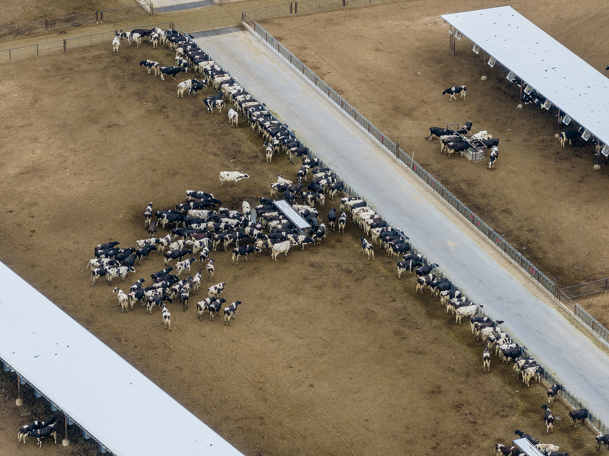
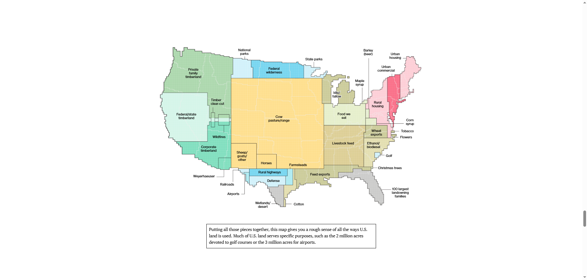
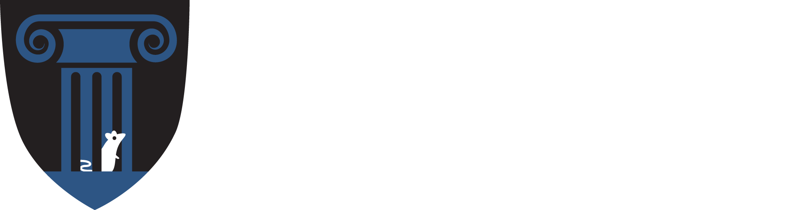
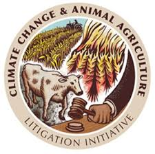
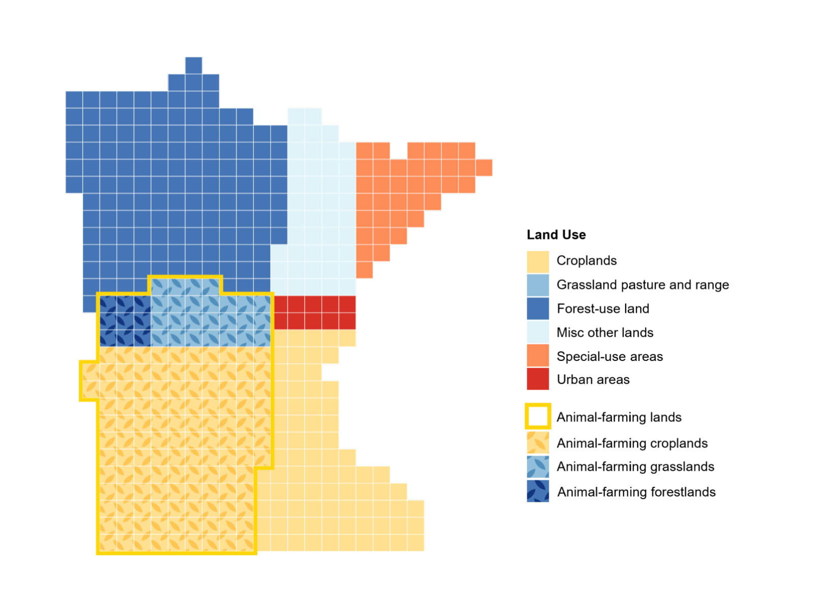
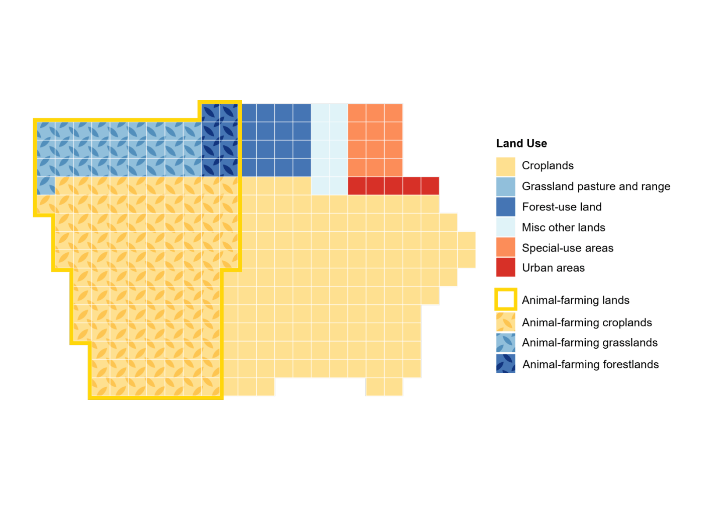

::: {.cr-section layout="overlay-center"}
[**Hoofprint: State Maps of Animal Agriculture’s Land Use**]{style="display:block; text-align:center;"} @cr-animal_ag

Industrial animal agriculture is a leading contributor to climate change, land degradation, water pollution, and biodiversity loss. Yet, despite its enormous environmental footprint, the scale of land use devoted to livestock production remains obscured in public understanding and in most policy discussions. @cr-animal_ag

Notably, land use decisions, particularly those favoring livestock and feed crop production, have significant climate impacts, contributing to greenhouse gas emissions, deforestation, soil degradation, and the loss of carbon-sequestering ecosystems. @cr-cattle

A 2018 national land use map published by Bloomberg powerfully visualized how much land is used to support animal agriculture. The map tells a striking story. When combining land used for cow pasture and land used to grow feed crops for livestock, forty-one percent of all land in the contiguous United States is tied to animal agriculture. The dominant user of American land is clear: cows. @cr-bloomberg

::: {#cr-animal_ag}

:::

::: {#cr-cattle}

:::

::: {#cr-bloomberg}

:::

:::

::: {.cr-section layout="overlay-center"}
“Hoofprint: State Maps of Animal Agriculture’s Land Use” aims to build on that narrative and deepen its impact by developing state-level land use maps that reveal similarly stark patterns at a finer geographic resolution. @cr-NYmap

Through our work in the Law, Environment & Animals Program (LEAP) at Yale Law School on animal agriculture and climate change, we work closely with external advocacy partners on the ground who have expressed a direct need for data and visuals to support their policy, legal, and public engagement efforts in Minnesota and New York. @cr-LEAP

A key organizational partner of LEAP’s Climate Change and Animal Agriculture Litigation Initiative (CCAALI) has expressed strong interest in the maps and will incorporate them into active advocacy campaigns and policy and litigation development efforts. This partner, a preeminent environmental law nonprofit, sees the maps as essential tools for shifting public narratives, engaging lawmakers, and increasing regulatory and legal accountability for the animal agriculture sector’s many harms. @cr-CCAALI

While Bloomberg’s national land use map offers a compelling overview, state-level maps provide the resolution needed to drive action where it matters most. Much environmental and climate policy is set at the state level, particularly under the current federal administration. @cr-MNmap

These maps will empower state lawmakers, advocates, and communities with localized data to inform land use planning, climate strategy, and agricultural reform. By making visible the scale and impact of animal agriculture within individual states, the project will better connect environmental harms to local experiences and support more targeted, community-driven solutions, advancing YPS’s goals of actionable, place-based climate work. @cr-IAmap

::: {#cr-NYmap}

:::

::: {#cr-LEAP}

:::

::: {#cr-CCAALI}
{style="width: 60vw; display: block; margin: auto;"}
:::

::: {#cr-MNmap}

:::

::: {#cr-IAmap}

:::

:::
