::: {.cr-section layout="overlay-center"}
[**New York Agricultural Land Use**]{style="display:block; text-align:center;"} [@cr-aerial]{scale-by=1.1}

Animal agriculture plays a significant role in shaping land use in New York State.[@cr-aerial]{pan-to="0%,10%" scale-by=3}

While forests, conserved lands, and urban centers often dominate public understanding of American landscapes, a substantial share of New York's actively managed land is tied to agricultural production. @cr-field_aerial

The land is particularly dedicated to livestock feed and grazing. [@cr-ny_ill_cow]{scale-by=3 pan-to="50%,18%"}

The Hoofprint project aims to make the footprint of that system visible through detailed mapping and analysis that distinguishes land use by purpose, especially through an examination of the land producing feed for animals as well as producing food for humans. [@cr-ny_ill_cow]{pan-to="-3%,-12%" scale-by="1.25"}

::: {#cr-aerial}
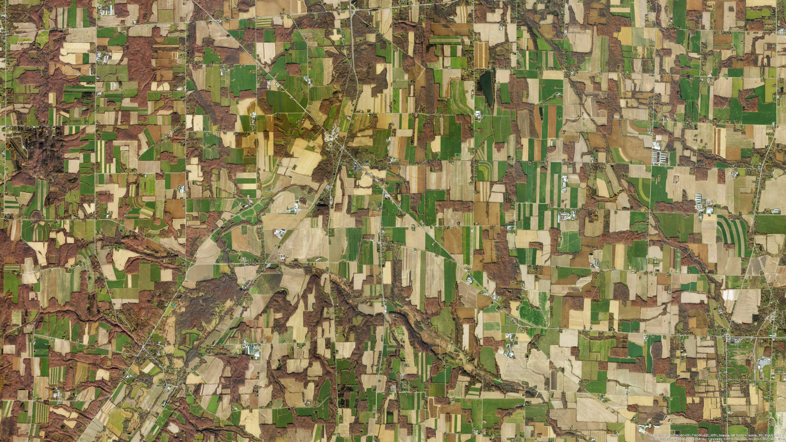
:::

::: {#cr-field_aerial}
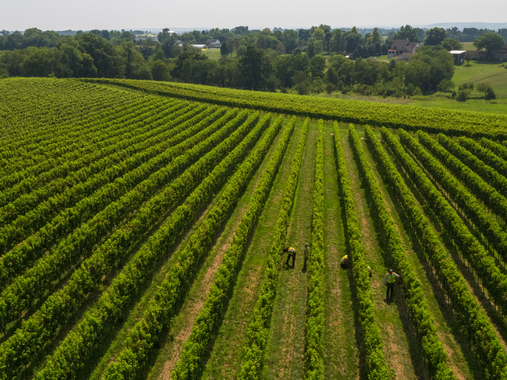
:::

::: {#cr-ny_ill_cow}

:::

:::

::: {.cr-section layout="overlay-center"}

Over the past two decades, New York's agricultural landscape has undergone substantial structural change. @cr-hay

:::{#cr-hay}
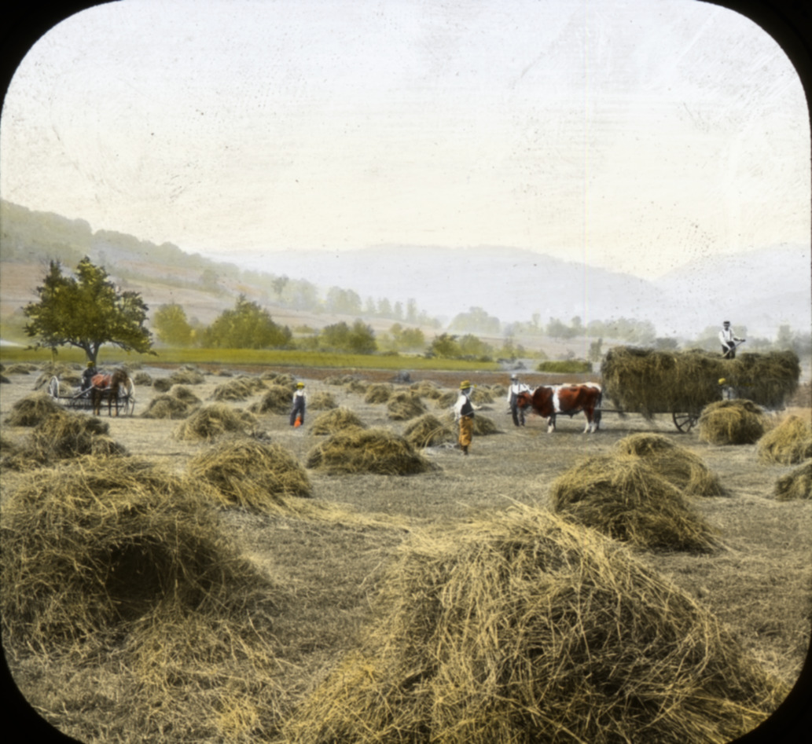
:::

:::

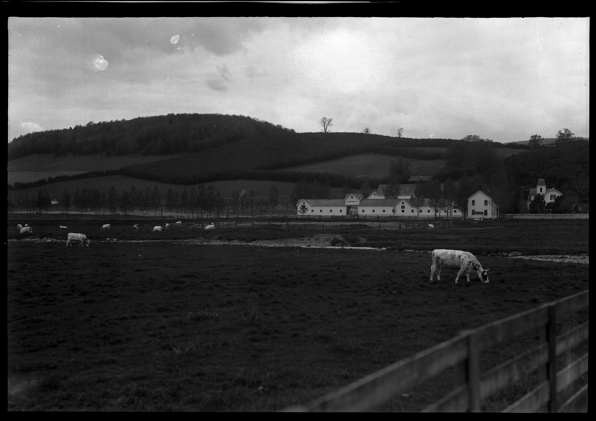{style="width:100vw; height:100vh; object-fit:cover; display:block;"}
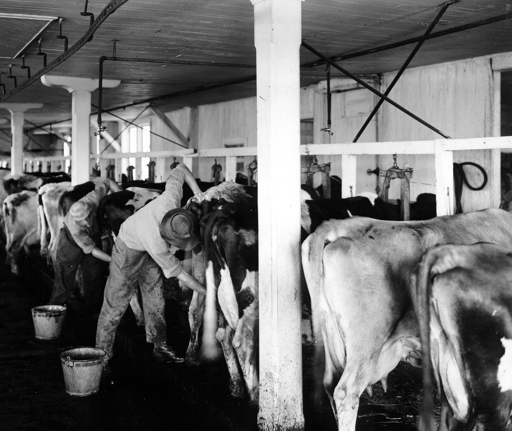{style="width:100vw; height:100vh; object-fit:cover; display:block;"}
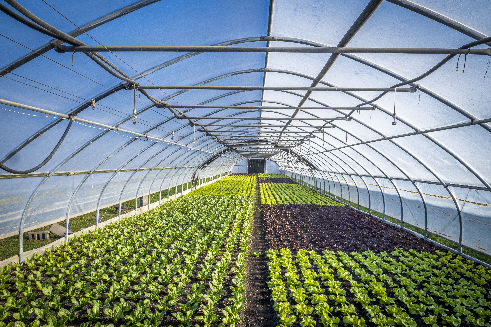{style="width:100vw; height:100vh; object-fit:cover; display:block;"}
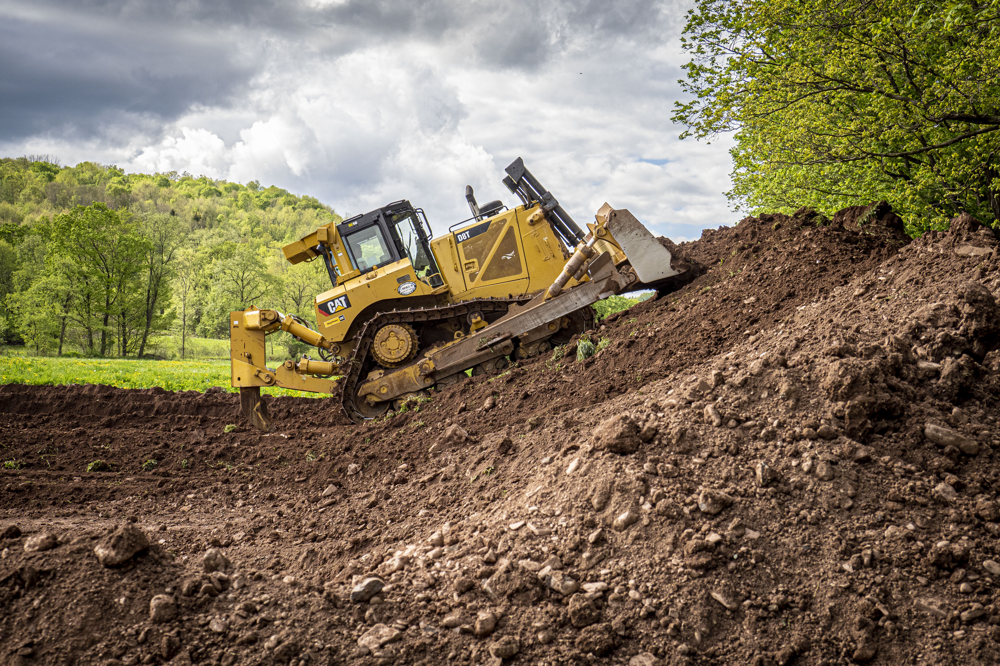{style="width:100vw; height:100vh; object-fit:cover; display:block;"}

::: {.cr-section layout="sidebar-left"}
While the total number of farms and total farmland acreage have both declined, [@cr-tot_farms]{scale-by=0.9}

average farm size has increased markedly, indicating consolidation and intensification of agricultural land use. [@cr-acres_per_farm]{scale-by=0.9}

USDA Census data (2022) show that acres per farm in New York rose from roughly 206 acres in 2002 to over 212 acres by 2022, even as the number of farm operations steadily declined. [@cr-horizontal]{scale-by=1.2}

This pattern suggests that agricultural production is becoming more spatially concentrated on fewer, larger holdings. [@cr-horizontal]{scale-by=1.2}

These background trends provide important context for the project. Even where total agricultural acreage appears relatively stable in aggregate statistics, land use is becoming more intensive and consolidated, which has implications for feed production, land management practices, and environmental pressures. @cr-change_county

::: {#cr-tot_farms}
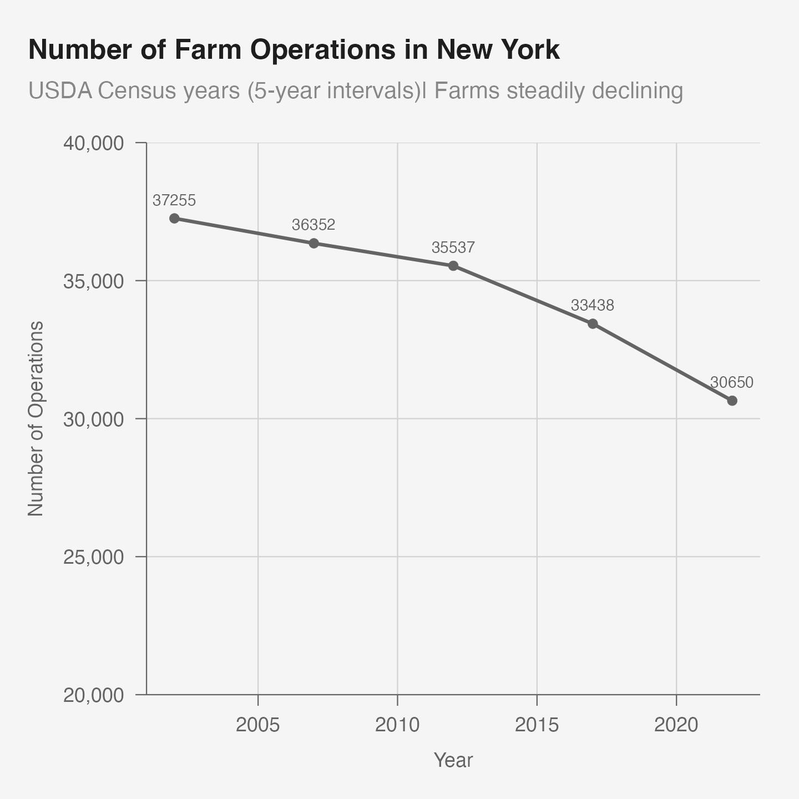
:::

::: {#cr-acres_per_farm}
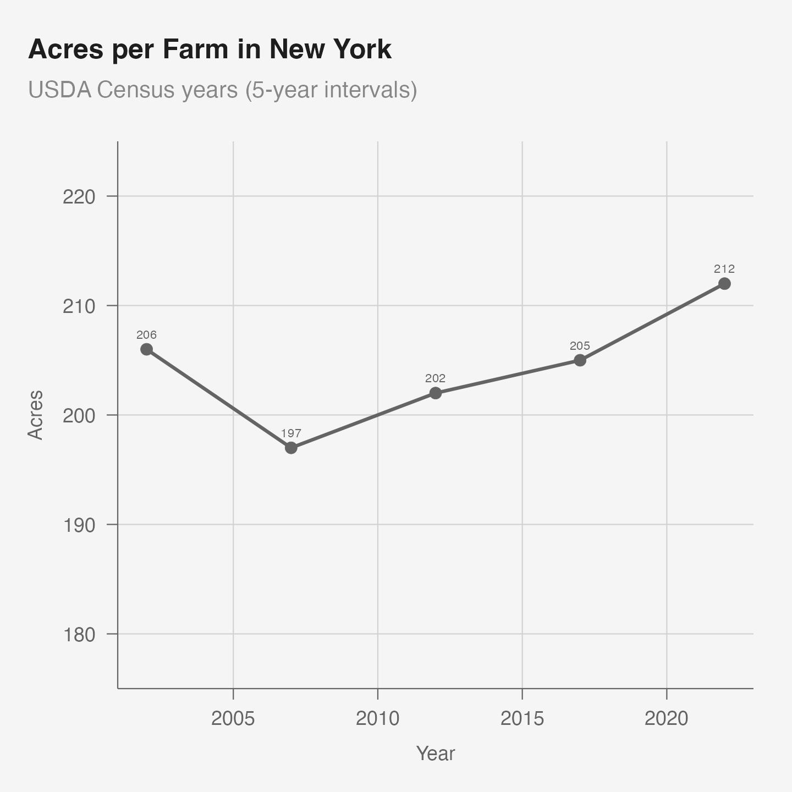
:::

::: {#cr-horizontal}
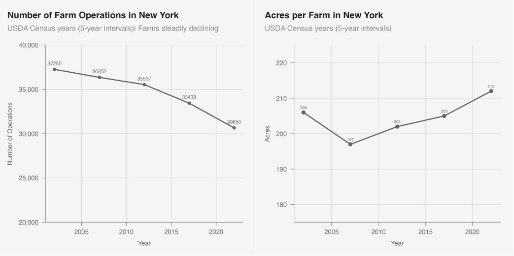
:::

::: {#cr-change_county}
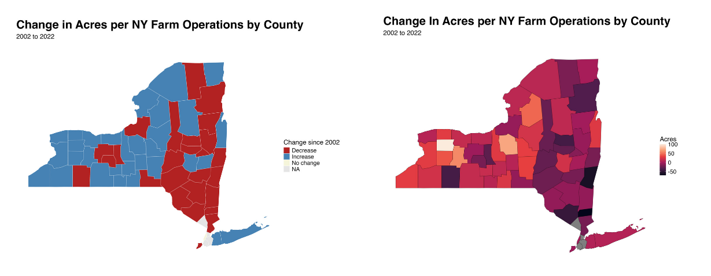
:::

:::

::: {.cr-section layout="overlay-center"}

**Objective and Scope** @cr-USDA_cattle

The overarching objective for the New York component of Hoofprint is to map and analyze land use in a way that highlights how much land is devoted to agricultural production, livestock use of pasture, and livestock feed production. @cr-USDA_cattle

Unlike general land-use maps that emphasize urbanization or broad ecological categories, this project focuses on the agricultural landscape and its intersections with pasture, forage, and cropland systems. @cr-USDA_cattle

::: {#cr-USDA_cattle}
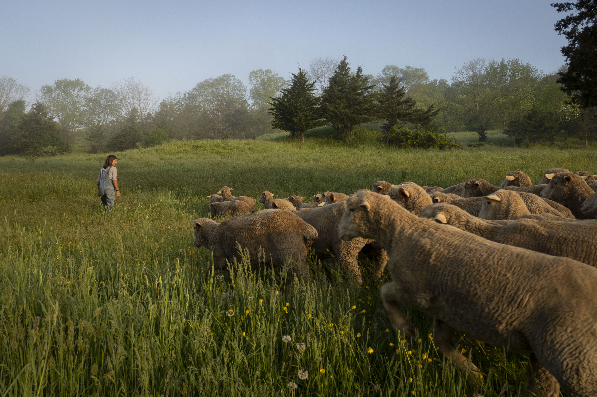
:::

:::

::: {.cr-section layout="sidebar-left"}

The maps and analysis herein seek to address the following questions:@cr-questions

:::{#cr-questions}
- How much of New York’s land area is devoted to agricultural uses, particularly those related to livestock?

- Within agricultural land, how much is devoted to feed production versus crops primarily used for human food or energy use?

- How do patterns of crop production correlate with livestock distribution, especially dairy cattle?

- What aspects of agricultural land use are not easily visible on a map but can be understood through other forms of data analysis or visualization?
:::

:::

::: {.cr-section layout="overlay-center"}

**Findings** @cr-dairy_farm

::: {#cr-dairy_farm}
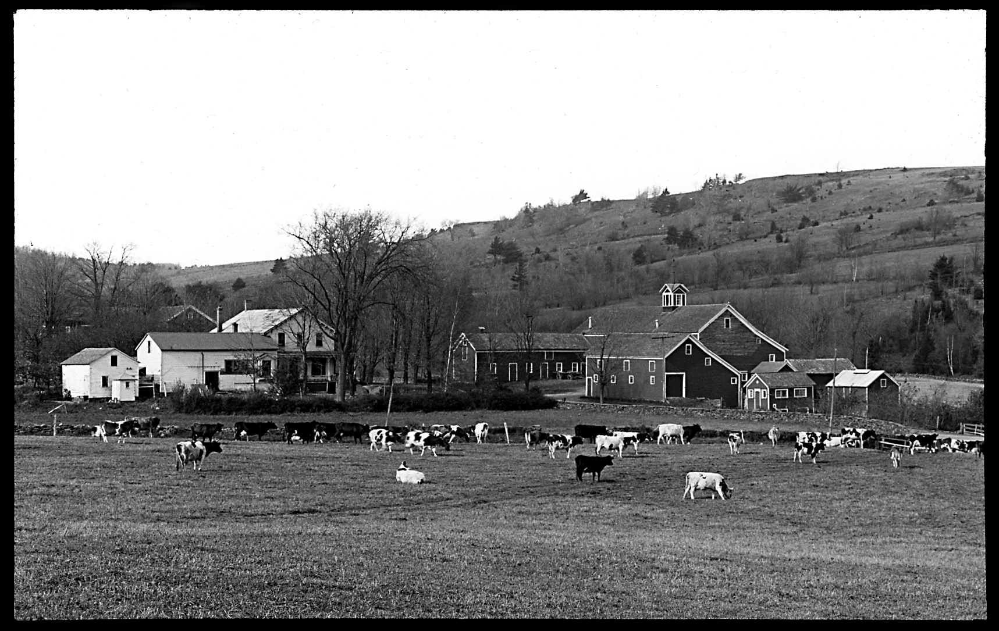
:::

:::

::: {.cr-section layout="sidebar-left"}

*Quantitative Land Use Breakdown* @cr-quant

:::{#cr-quant}
Using USDA Major Uses of Land (MLU) totals translated into standardized map tiles, New York’s land base is dominated by forest land, followed by cropland and grassland, with relatively small shares devoted to urban, special, and miscellaneous uses.
:::

:::

::: {.cr-section layout="sidebar-left"}
The following maps use a simplified, proportional visualization approach to show how land is allocated across major categories such as forest, cropland, grassland, and urban land. @cr-ny_spatial

Each colored square ("tile") represents approximately 125,000 acres of land. [@cr-ny_spatial]{pan-to="30%,10%" scale-by=3.3}

The total number of tiles in each category matches official statewide acreage totals from the U.S. Department of Agriculture's Major Uses of Land (MLU) statistics. [@cr-ny_spatial]{pan-to="-98%,-17%" scale-by=3}

The maps are designed to communicate relative land shares clearly, not to depict exact field boundaries, parcel locations, or farm ownership. The spatial arrangement of tiles preserves the general outline of the New York State and broad geographic coherence, but individual tiles should not be interpreted as showing precise land-use locations. @cr-ny_spatial

The map highlighting land associated with animal agriculture groups together tiles representing feed cropland and grazing land into a single, contiguous region for visual clarity. @cr-ny_animal_ag

This region does not show the actual locations of livestock farms. Instead it represents the proportional amount of land used to support livestock production, based on feed and grazing acreage totals. [@cr-ny_animal_ag]{pan-to="-3%,-12%" scale-by="1.3"}

::: {#cr-ny_spatial}
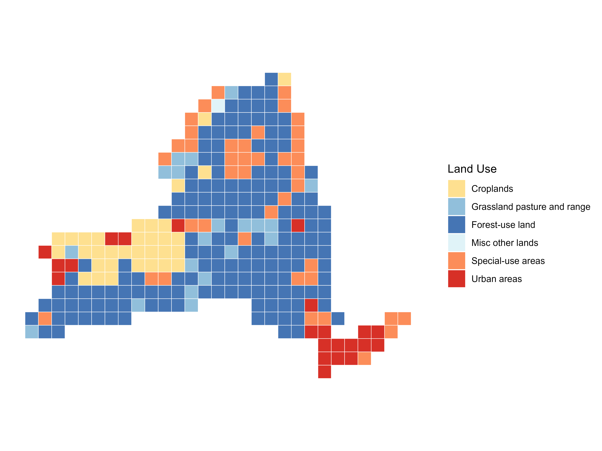
:::

::: {#cr-ny_animal_ag}
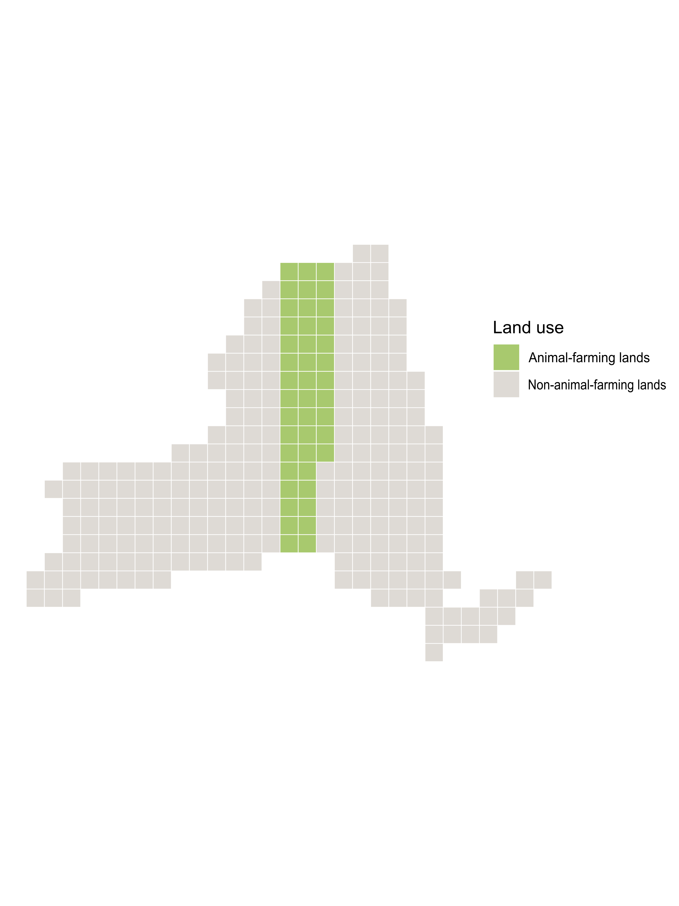
:::

:::

::: {.cr-section layout="sidebar-left"}
 @cr-ny_ill_with_cow

Within cropland, approximately 2.15 million acres, roughly 52 percent of total cropland, are used for animal-feeding crops @cr-ny_ill_crop

Grassland grazing accounts for approximately 2.69 million acres. @cr-ny_ill_grass

In addition, smaller fractions of cropland and forest land are also used for grazing. @cr-ny_ill_crop_forest

These figures make visible the extent to which livestock systems structure New York’s agricultural land use, even before accounting for mixed-use crops such as corn grain and soybeans that are partially allocated to feed. @cr-ny_ill_with_cow

::: {#cr-ny_ill_crop}
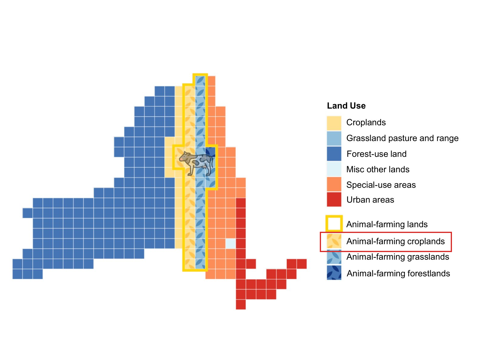{style="height:85vh; width:auto;"}
:::

::: {#cr-ny_ill_grass}
{style="height:85vh; width:auto;"}
:::

::: {#cr-ny_ill_crop_forest}
{style="height:85vh; width:auto;"}
:::

::: {#cr-ny_ill_with_cow}

:::
:::

::: {.cr-section layout="sidebar-right"}

Preliminary mapping and quantitative data reveal that a substantial proportion of New York’s actively managed land is agricultural, and much of that is tied to livestock feed production and grazing.  @cr-ag_dom_text

Cropland devoted to feed and forage crops, combined with grassland pasture and range, represents a significant share of agricultural acreage. Several major crop categories are used almost entirely for animal feed.  @cr-ag_dom_text

Overall, roughly 22% of New York’s land area is related to agricultural use (cropland and grazing grassland), and about 70% of this ultimately supports livestock production (through feed crops and grazing). @cr-strip_map

::: {#cr-ag_dom_text style="display:flex; align-items:center; justify-content:center; height:100%; text-align:center;"}
*Agriculture Dominates Actively Managed Land*
:::

::: {#cr-strip_map}

:::
:::

::: {.cr-section layout="center"}

Forage crops, including corn silage, alfalfa, and other hay crops, are effectively 100 percent dedicated to livestock feeding, forming the backbone of dairy and livestock production systems. Other major crops are more mixed in their end use but still contribute substantially to feed supply. @cr-strip_map1

National production-use statistics from the USDA Economic Research Service’s (ERS) Supply and Disappearance Tables, applied as allocation assumptions for New York state, indicate that approximately 45-50 percent of field corn production ultimately enters livestock feed channels (including ethanol co-products returned to feed markets) (cite), while at least 30 percent of soybean production contributes to domestic livestock feed via soybean meal (cite), with most remaining production directed to industrial or export markets rather than direct human food consumption.  @cr-strip_map1

::: {#cr-strip_map1}

:::

:::

::: {.cr-section layout="sidebar-left"}
*Forage and Feed Crops Are Central* @cr-forage_feed_text

National and state production data indicate that these crops account for a large share of cropland acreage in the state, particularly in counties with high dairy density. @cr-corn_usage

*Dairy Cattle Drive Feed Crop Production* @cr-cattle_breakdown

Regression analysis demonstrates a strong statistical relationship between dairy cow inventories and acreage of key feed crops like corn silage, reinforcing the central role that dairy production plays in structuring land use. In contrast, beef cattle show a much weaker or inconsistent association, reflecting more diffused production systems. @cr-regression

The figure to the right plots dairy cow inventory against silage corn acreage at the county level, making this relationship visible across New York's agricultural regions. @cr-regression

::: {#cr-forage_feed_text}
Cropping patterns show the concentration of silage, hay, and alfalfa, all of which are assumed to be used exclusively for livestock feed. 
:::

:::{#cr-corn_usage}
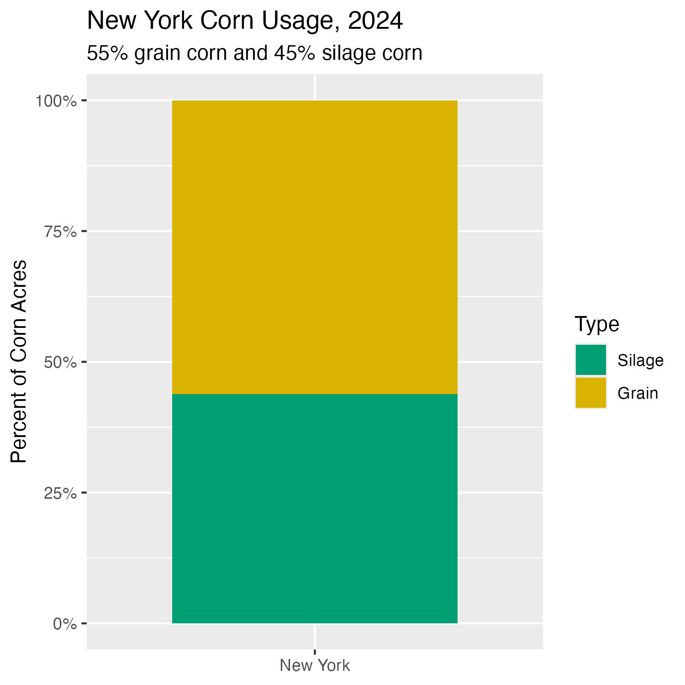
:::

:::{#cr-cattle_breakdown}
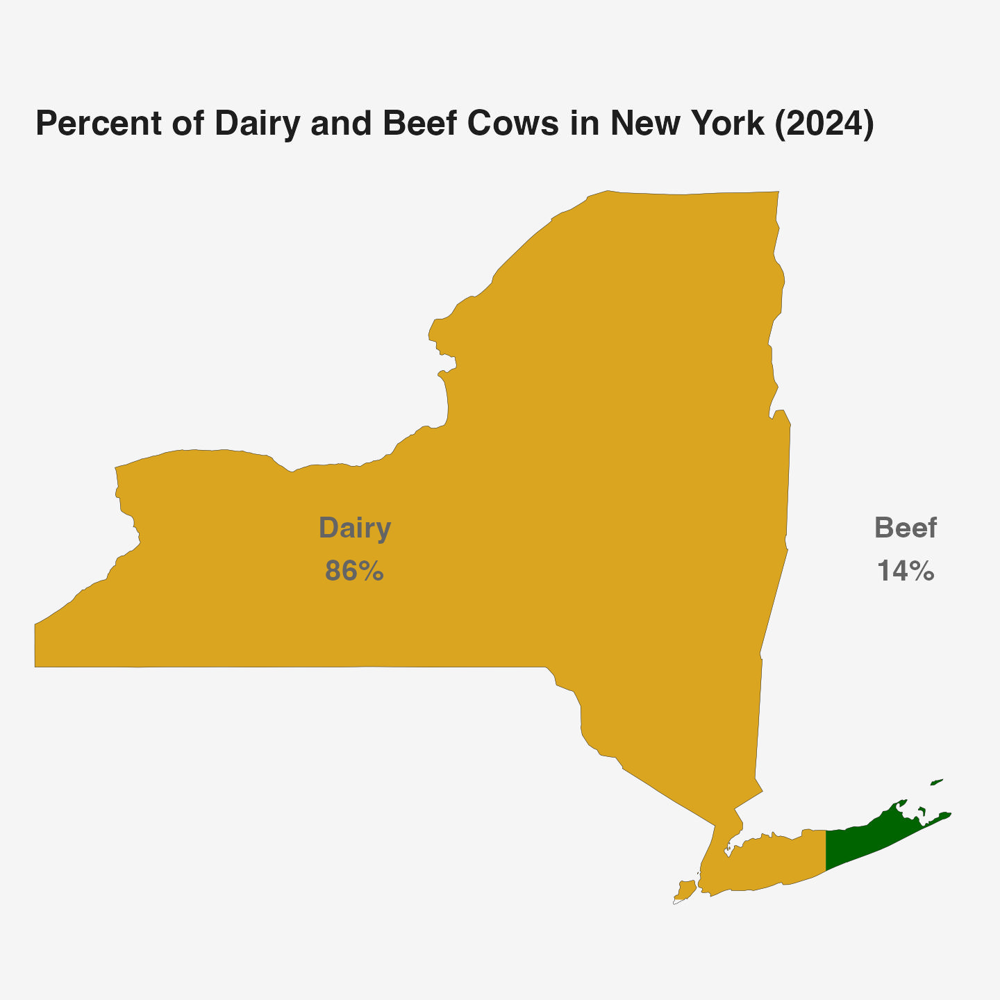
:::

:::{#cr-regression}
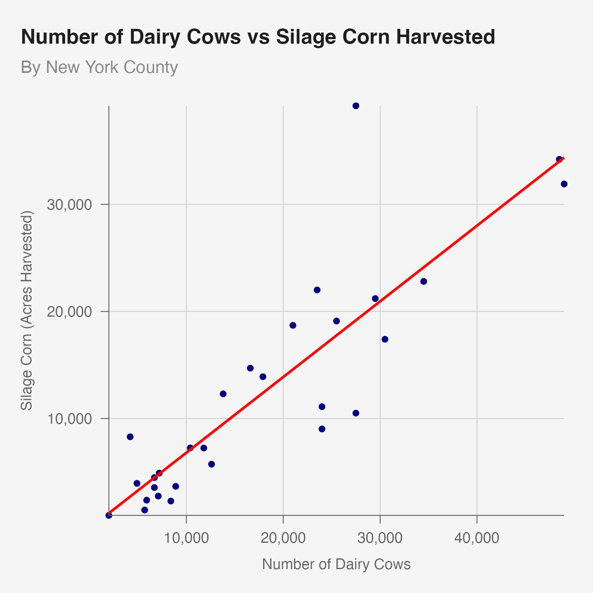
:::

:::

::: {.cr-section layout="sidebar-left"}
*Declining Pastureland with Stable Livestock Inventories* @cr-pl_text

USDA Census data (2022) shows that pastureland acreage in the state declined by approximately 46.2 percent between 2002 and 2022 @cr-pl_decline

while total cattle inventories decreased only by about 2.3 percent over the same period. @cr-cattle_inv

This divergence suggests that livestock production has become increasingly land-intensive and decoupled from pasture availability, possibly relying more heavily on confined systems and on cropland-based feed production. @cr-pl_change

This reinforces the central role of silage, hay, and feed crops in sustaining New York’s livestock systems and highlights pressures on land resources that may not be immediately visible from static land-use maps. @cr-pl_change

*Declining Cropland Acreage and Increasing Pressure on Feed Systems* @cr-cl_text

USDA Census data (2022) indicates a steady reduction in total cropland acreage between 2002 and 2022, with a particularly sharp decline between 2017 and 2022. @cr-cl_change

When considered alongside relatively stable livestock inventories and rising feed demands from dairy systems, this contraction in cropland suggests increasing pressure on remaining agricultural land to sustain feed production. @cr-cl_cattle

These trends reinforce the importance of examining not only land allocation by category but also changes in land availability over time. @cr-cl_cattle

:::{#cr-pl_text}
Long-term pastureland trends underscore the intensification of land use within New York’s livestock sector.
:::

:::{#cr-pl_decline}
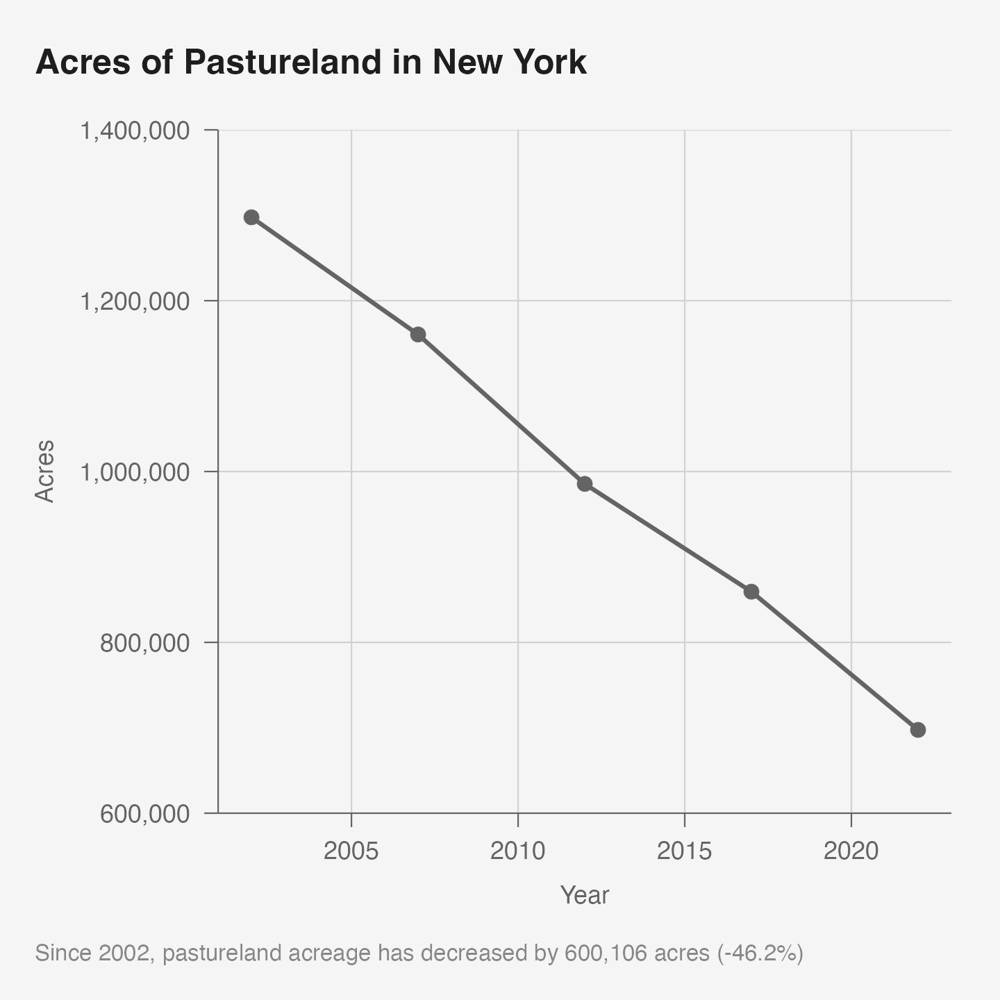
:::

:::{#cr-cattle_inv}
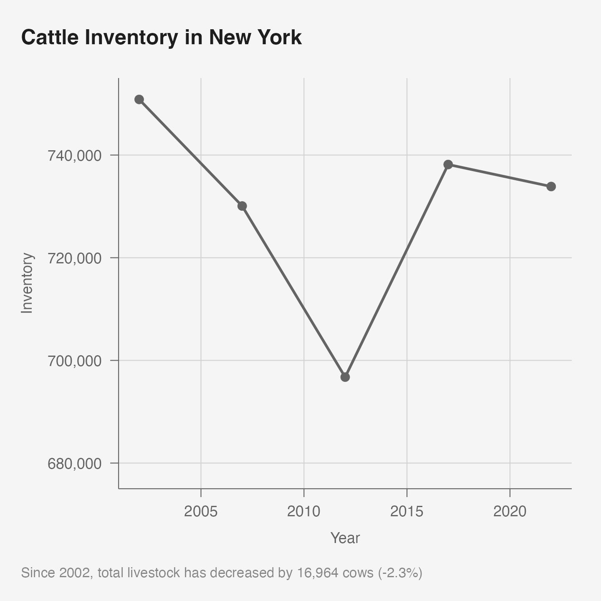
:::

:::{#cr-pl_change}
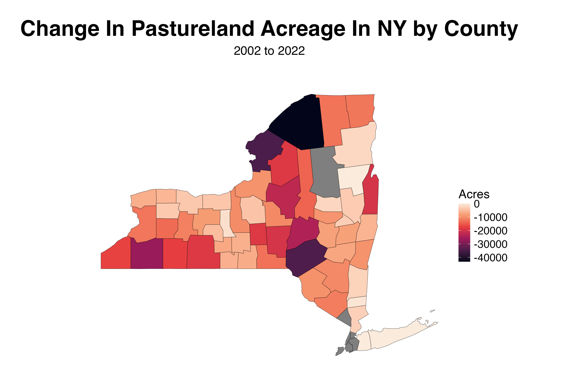
:::

:::{#cr-cl_text}
Cropland acreage in New York has also declined over time, adding further constraints to the land supporting feed production. 
:::

:::{#cr-cl_change}
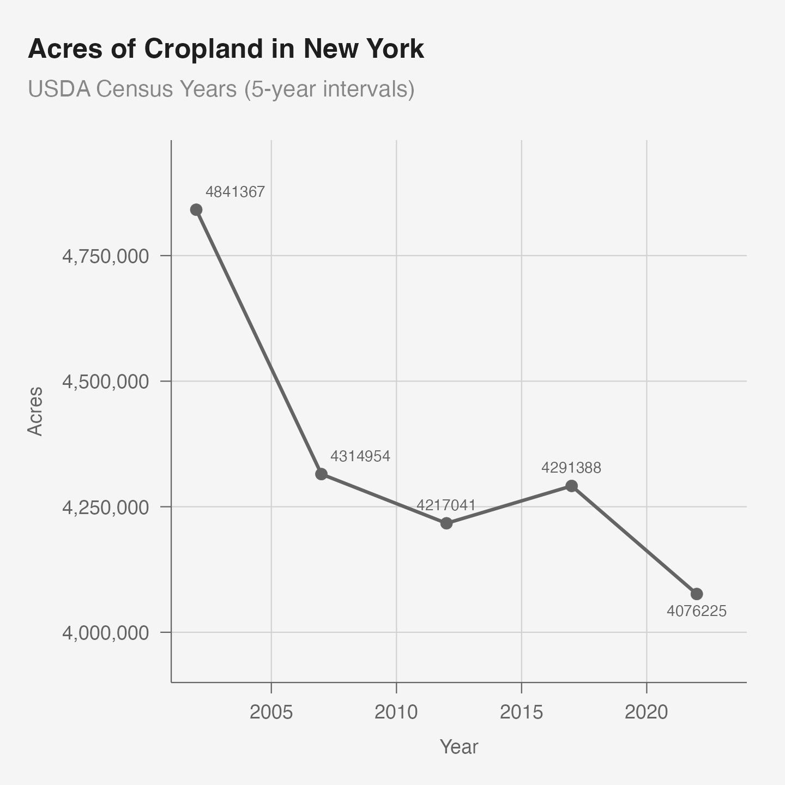
:::

:::{#cr-cl_cattle}
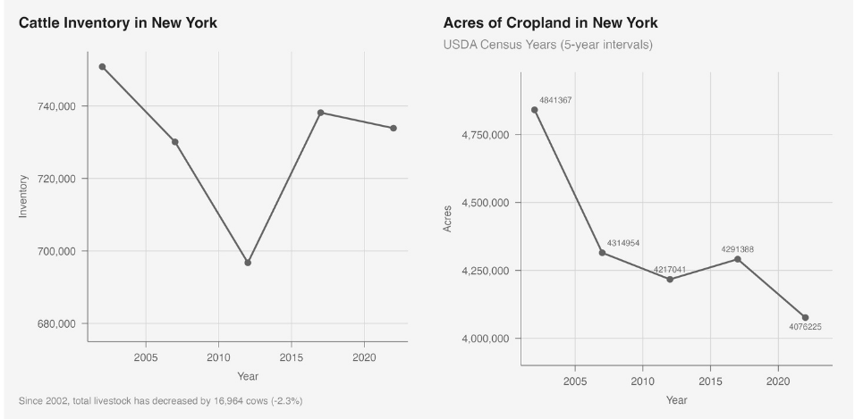
:::

:::

::: {.cr-section layout="sidebar-left"}
*Feed Consumption Reinforces Agricultural Intensity* @cr-feed_consumption_text

*​​​​​Land Use Change and Conversion Pressure* @cr-landuse_change_text

*Carbon Opportunity Costs of Feed Cropland* @cr-coc_text

*Climate Impacts of Land-Intensive Livestock Systems* @cr-climate_text

:::{#cr-feed_consumption_text}
While not directly presentable in a map, feed consumption estimates show that New York is a substantial consumer of livestock feed ingredients, especially dairy cattle. This underscores the demand side of animal agriculture and complements the supply side observations from crop and land data, even as we reiterate that consumption figures cannot substitute for maps of what is produced within the state. 
:::

:::{#cr-landuse_change_text}
Although New York’s total agricultural acreage has declined over the past two decades, aggregate land-use statistics can mask important structural changes, including consolidation, intensification, and shifting land allocation among pasture, cropland, and non-agricultural uses. In some regions, marginal pastureland is being converted to row crop production for feed, while other areas are seeing agricultural land converted to low-density residential or non-agricultural use. These dynamics have implications for habitat fragmentation, water management, and rural development patterns. 

While we don’t directly measure land use change over time in this project, the spatial distribution of cropland, pasture, and forest lands highlights regions where land use transitions are most likely to occur. Prior research and agricultural trends data suggest that pressures from feed crop demand, development, and farm consolidation can drive shifts among pasture, cropland, and non-agricultural uses. According to a 2025 audit by the New York State Comptroller’s Office, USDA Census data shows that NY state lost roughly 365,000 acres of farmland and nearly 2,800 farms between 2017 and 2022, equivalent to an area larger than 430 Central Parks. The audit attributed these changes to financial pressure on farmers, increasing land value, and development pressures, including conversion to residential, commercial, and, in some cases, renewable energy uses such as solar arrays on agricultural land. These loss patterns, while not directly mapped in the current project, provide important context and suggest that land use dynamics in New York are not static, and that pressures on farmland, including feed crop land, may influence future land-use distributions. 
:::

:::{#cr-coc_text}
Large areas of New York’s cropland are dedicated to feed crops that could otherwise support alternative land uses with greater carbon sequestration potential, such as reforestation or afforestation. New York is distinctive among the three states in this analysis in that more than half its total land area is already forested. The dairy-producing heartland of western and central New York is surrounded by and interspersed with temperate forest land, making reforestation the most ecologically coherent transition pathway for land currently dedicated to corn silage and hay production. 

The concept of carbon opportunity cost (COC) highlights the foregone climate benefits associated with keeping land in high-emission agricultural use instead of allowing it to recover carbon naturally. In regions dominated by feed production for dairy, the COC may represent a substantial but often overlooked component of the livestock system’s total climate footprint. Our data reveals that substantial areas of New York’s cropland are devoted to feed production, particularly for dairy systems. From a land-use perspective, this raises questions about carbon opportunity costs, or the foregone climate benefits that could accrue if some land was instead allocated to lower-emission or carbon-sequestering uses. While this project does not estimate carbon outcomes directly, it identifies the spatial footprint of cropland used for animal feed as a key input for climate modeling. Published estimates (Gorte, 2009) illustrate the scale of this opportunity cost. For example, a 100-acre field currently used for corn silage could potentially sequester roughly 110 to 770 metric tons of CO₂ per year if converted to forest, depending on tree species, soil conditions, and regional climate. While actual outcomes vary and this study does not model sequestration directly, such comparisons help contextualize how land devoted to feed production represents not only current agricultural output but also foregone climate mitigation potential. 
:::

:::{#cr-climate_text}
New York’s dairy and livestock industries are major contributors to agricultural greenhouse gas emissions, particularly methane from enteric fermentation and manure management, and nitrous oxide from feed production. The spatial concentration of livestock operations, especially in areas with intensive corn silage and hay cultivation, amplifies localized emissions and ties land use directly to climate outcomes. At the same time, emissions from cattle systems remain highly underestimated, due in part to a lack of granular, state-specific data on feed production, sourcing, and use. Insufficient feed data is a critical driver of uncertainty in emissions estimates, compounded by rapid changes in land use, evolving production practices, and limited temporal resolution in available datasets. These data gaps and dynamics contribute to wide variability in emissions modeling results and make it difficult to fully capture the climate impacts of land-intensive livestock systems. More broadly, the contribution of land use and livestock production to global temperature increases remains a significantly under-researched area, underscoring the importance of improved land use mapping and data integration as foundational inputs for climate analysis and accountability. 
:::

:::

::: {.cr-section layout="overlay-center"}
**Policy Recommendations** @cr-aerial_USDA

Hoofprint reveals the outsized land use of livestock systems in New York, particularly grazing grassland and cropland used for animal feed. This has major implications for climate mitigation, land-use efficiency, and food system transformation. The following recommendations aim to inform local and state policymaking based on key findings. @cr-aerial_USDA

::: {#cr-aerial_USDA}

:::

:::

::: {.cr-section layout="sidebar-left"}
*Feed Supply Chain Transparency Requirements* @cr-rec1

*Integrate Carbon Opportunity Costs (COC) into State Climate Planning* @cr-rec2

*Incentivize Diversification Away from Feed Crops* @cr-rec3

:::{#cr-rec1}
The disconnect between feed crop production and livestock siting impedes emissions accountability and regional impact assessments, especially as the origins of feed inputs used by large dairies and livestock operations are often opaque. The state should introduce reporting requirements or voluntary disclosure programs for large dairies and meat processors regarding sourcing regions for major feed components such as corn silage, grain, and soybean meal. Improved transparency would support more accurate greenhouse gas accounting, strengthen regional land-use planning, and enable regulators to trace environmental impacts across the feed supply chain.  
:::

:::{#cr-rec2}
Current climate mitigation planning or GHG inventories do not account for the opportunity costs of maintaining land in emissions-intensive agricultural uses, also known as carbon opportunity costs. Given the large footprint of feed cropland identified in the project, New York State agencies should begin incorporating carbon opportunity cost considerations into land-based mitigation planning. The state could direct the Climate Action Council and/or the Department of Environmental Conservation (DEC) to incorporate these into scenario modeling and updates to the state's GHG inventory. Including COC would improve long-term planning around reforestation, restoration, and cropland transitions. 
:::

:::{#cr-rec3}
Over half of New York’s cropland is used for animal feed, reinforcing dependence on livestock systems, and reducing land-use resilience. As a result, agricultural land use is closely tied to livestock market conditions. New York should establish programs within the Department of Agriculture & Markets to offer subsidies, cost-share incentives, or technical assistance for farms transitioning part of their cropland from livestock feed production to specialty or human-edible food crops such as legumes, grains, or vegetables. This could diversify food supply chains and reduce GHG-intensive cropping patterns. 
:::

:::